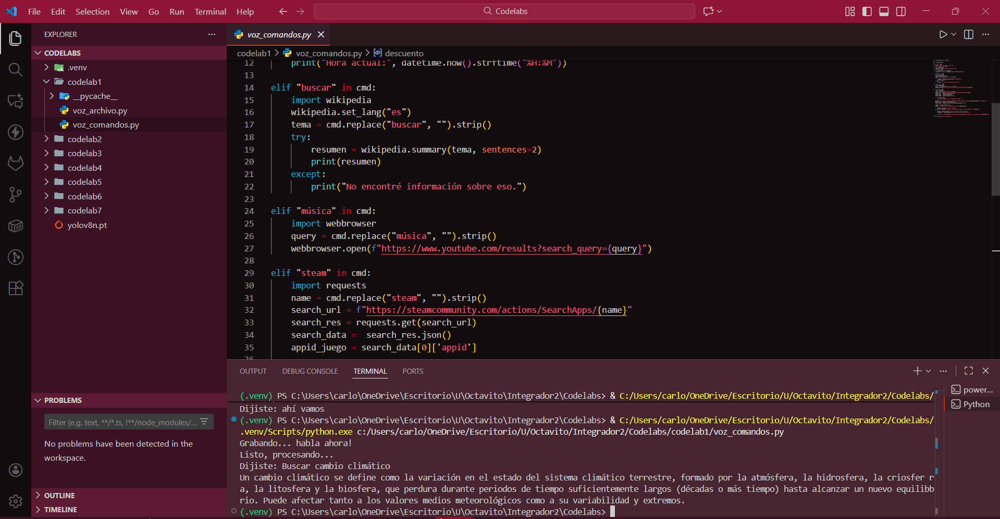

Resultado en consola

# Repaso – Respuestas cortas

## ¿Qué librerías se usaron?

sounddevice, scipy, speech_recognition, tempfile y os.

## ¿Por qué no usamos PyAudio?

Porque da muchos problemas de instalación, especialmente en Windows.

## ¿Qué hace recognize_google?

Convierte el audio grabado en texto usando el servicio de Google.

## ¿Qué pasa si no entiende lo que dijiste?

Muestra un mensaje indicando que no se pudo reconocer el audio.

## ¿Cómo se guardó el WAV temporal?

Con un archivo temporal creado con tempfile y eliminado al final.

## Diferencia entre voz_archivo.py y voz_comandos.py

Uno graba y transcribe; el otro interpreta el texto y ejecuta comandos.

## Ejemplo de comando implementado

"abrir google": abre el navegador en Google.

## Aplicaciones reales

Asistentes de voz, automatización, accesibilidad, búsquedas rápidas.

## ¿Cómo manejar un error de conexión?

Mostrando un aviso claro y permitiendo reintentar más tarde.

## Mejoras propuestas

Motor offline, reconocimiento continuo, más comandos y respuesta con voz.
