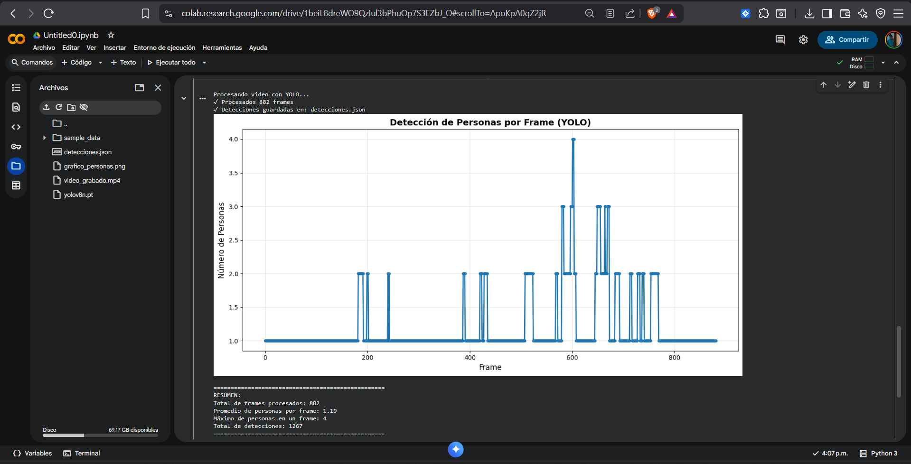

## El reto se realizo en colab por errores en mi entorno local

# Respuestas de las preguntas

### ¿Cómo varía la velocidad de detección entre imágenes y webcam?

La detección en imágenes suele ser más rápida porque solo se procesa un único frame.
En cambio, al trabajar con video o webcam, el sistema debe analizar una secuencia continua de fotogramas (alrededor de 30 fps en condiciones normales), lo que aumenta la carga de procesamiento. Además, una imagen puede optimizarse antes de analizarla, cosa que no ocurre en tiempo real.

### ¿Qué limitaciones presenta YOLO-lite al detectar objetos pequeños?

YOLO-lite trabaja con menor resolución y, por diseño, los modelos YOLO suelen tener más dificultad para reconocer objetos pequeños. Eso hace que algunos de estos elementos puedan pasar desapercibidos o detectarse con poca precisión.

### ¿En qué proyectos podría utilizarse?

Tiene aplicaciones muy variadas. Es útil en sistemas IoT de seguridad, como detección de intrusos en hogares, o para conteo de personas en espacios específicos. Incluso se ha usado en proyectos urbanos, por ejemplo, un estudio que analizaba cuántas personas ingresaban sin pagar al sistema de transporte TransMilenio en Bogotá mediante visión artificial.
