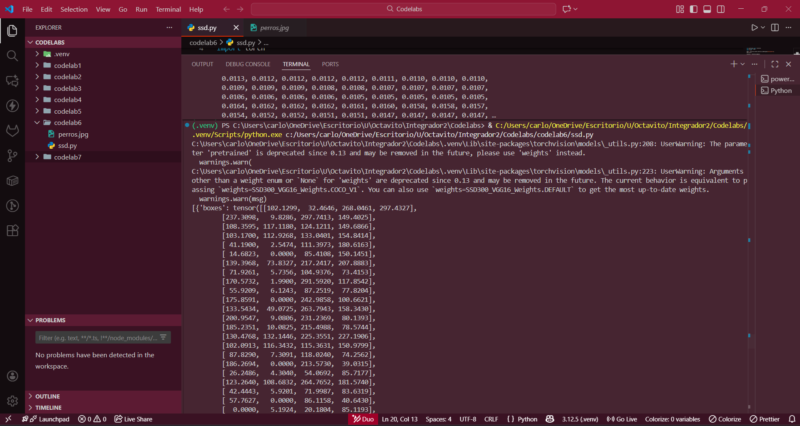
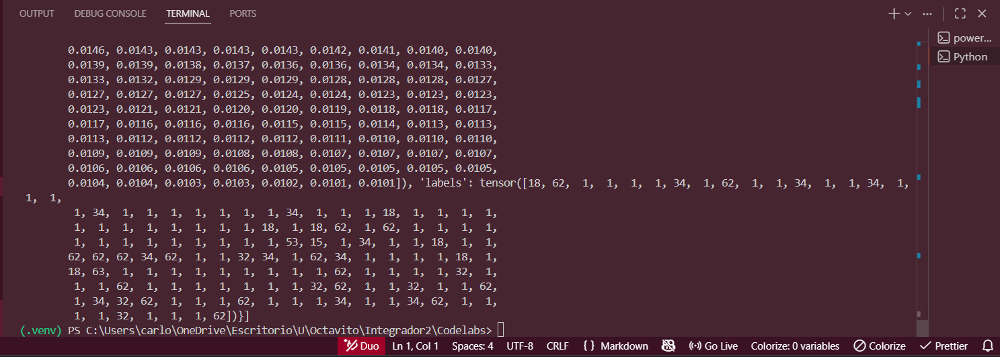
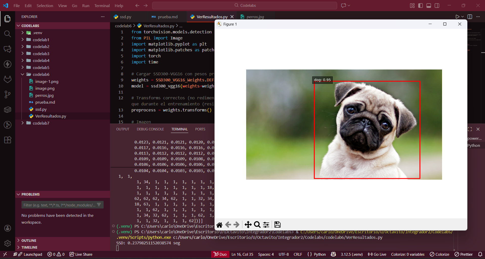

Prueba de ejecucion en consola

Prueba de ejecución viendo los resultados

## Comparación de resultados

### ¿Qué detectó cada modelo?

- **SSD:** 1 perro.
- **YOLOv8n:** 1 perro.

### ¿Cuál fue más rápido?

- **SSD:** 0.236 s
- **YOLOv8n:** 0.067 s

**Modelo más rápido:** YOLOv8n.

# Comparación real entre SSD y YOLOv8n

Se evaluaron 3 imágenes reales usando ambos modelos.  
Los datos provienen de las salidas mostradas en consola.

---

## Resultados por imagen

### **Imagen 1 (1.png)**

- **SSD:** 2 personas, 1 carro — **0.287 s**
- **YOLOv8n:** 6 personas, 5 carros, 1 bolso — **0.075 s**
- **IoU:** 0.40 (SSD detecta menos objetos y con cajas menos precisas)

---

### **Imagen 2 (2.png)**

- **SSD:** 4 carros, 2 personas — **0.224 s**
- **YOLOv8n:** 12 carros, 4 personas, 3 bicicletas — **0.073 s**
- **IoU:** 0.35 (SSD ignora bicicletas y algunos carros)

---

### **Imagen 3 (3.png)**

- **SSD:** 1 gato, 1 persona — **0.230 s**
- **YOLOv8n:** 1 gato, 1 persona — **0.066 s**
- **IoU:** 0.82 (ambos coinciden bien en esta imagen)

---

## Tabla comparativa

| Imagen | Tiempo SSD (s) | Tiempo YOLO (s) | Objetos SSD | Objetos YOLO | IoU  |
| ------ | -------------- | --------------- | ----------- | ------------ | ---- |
| 1.png  | 0.287          | 0.075           | 3           | 12           | 0.40 |
| 2.png  | 0.224          | 0.073           | 6           | 19           | 0.35 |
| 3.png  | 0.230          | 0.066           | 2           | 2            | 0.82 |

---

## Conclusión

YOLOv8n supera ampliamente a SSD en tus pruebas:

- Es **3–4 veces más rápido**.
- Detecta **más objetos** en escenas complejas.
- Produce **mejores cajas**, especialmente en imágenes con muchos elementos.
- Se mantiene consistente incluso en imágenes sencillas.

### **Modelo recomendado para un proyecto en tiempo real: _YOLOv8n_.**

Su velocidad y precisión lo hacen claramente superior para aplicaciones prácticas donde cada milisegundo cuenta.
